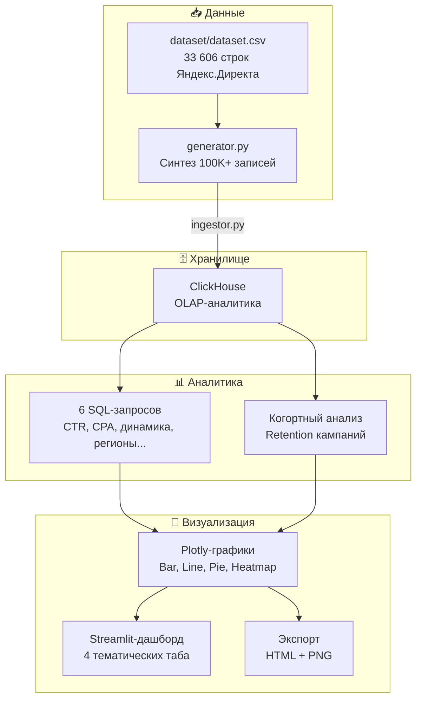

<div align="center">

# 📊 clickhouse-marketing-analytics

**Модульный Python-пакет для end‑to‑end аналитики рекламных кампаний Яндекс.Директа**

[](https://python.org)
[](https://clickhouse.com)
[](https://streamlit.io)
[](https://docker.com)
[](LICENSE)
[](tests/)

---

**Генерация данных → ClickHouse → SQL‑аналитика → Когорты → Визуализация**

</div>

---

## ✨ Возможности

| | |
|---|---|
| 🔄 **Полный пайплайн** | От сырых данных до интерактивного дашборда одной командой |
| 🐳 **ClickHouse в Docker** | Молниеносная OLAP‑аналитика без сложной настройки |
| 📈 **6 аналитических SQL‑запросов** | CTR, CPA, динамика, регионы, эффективность групп, дни недели |
| 👥 **Когортный анализ** | Retention кампаний и ключевых слов по недельным когортам |
| 🎨 **Streamlit‑дашборд** | 4 тематических таба с Plotly‑графиками (интерактивный режим) |
| 🧪 **14 тестов** | Генерация, SQL‑синтаксис, когорты — всё проверено |
| 🧩 **Чистая архитектура** | Разделение на слои: данные → аналитика → визуализация |

---

## 🚀 Быстрый старт

```bash
# 1. Клонировать и настроить
git clone <repo-url>
cd clickhouse-marketing-analytics
copy .env.example .env              # Windows
pip install -r requirements/dev.txt

# 2. Запустить ClickHouse
docker compose -f docker/docker-compose.yml up -d

# 3. Полный пайплайн (генерация → загрузка → аналитика → графики)
python scripts/run_pipeline.py
```

👉 Откройте [localhost:8501](http://localhost:8501) для интерактивного дашборда.

---

## 📦 Технологический стек

| Компонент | Технология | Назначение |
|---|---|---|
| **База данных** |  | Колоночная OLAP‑БД для быстрых агрегаций |
| **Контейнеризация** |  | ClickHouse в изолированном контейнере |
| **Конфигурация** |  | Валидация настроек из `.env` |
| **Аналитика** |  + raw SQL | Обработка результатов запросов |
| **Визуализация** |  •  | Графики и интерактивный дашборд |
| **Экспорт** |  + Kaleido | PNG / HTML отчёты |
| **Тесты** |  | 14 тестов, все проходят |

---

## 🧭 Архитектура проекта

```
clickhouse-marketing-analytics/
├── 📁 docker/                    # ClickHouse в Docker Compose
│   ├── docker-compose.yml
│   └── clickhouse/
│       ├── init.sql              # DDL при старте (БД marketing + таблицы)
│       └── config.xml
│
├── 📁 src/                       # Python-пакет
│   ├── config.py                 # Pydantic-конфигурация (.env)
│   ├── pipeline.py               # Полный пайплайн одной командой
│   │
│   ├── 📁 db/                    # ClickHouse-слой
│   │   ├── client.py             # HTTP-клиент (singleton)
│   │   └── schema.py             # DDL-константы
│   │
│   ├── 📁 data/                  # Данные
│   │   ├── loader.py             # Чтение реального CSV
│   │   ├── generator.py          # Синтез 100K+ записей
│   │   └── ingestor.py           # CSV → ClickHouse
│   │
│   ├── 📁 analytics/             # Аналитика
│   │   ├── queries.py            # Загрузчик SQL-файлов
│   │   ├── runner.py             # 6 запросов → DataFrame
│   │   └── cohort.py             # Когортный анализ (retention)
│   │
│   └── 📁 viz/                   # Визуализация
│       ├── charts.py             # Plotly-чарты (bar, line, pie)
│       ├── heatmap.py            # Тепловые карты
│       ├── dashboard.py          # Streamlit (4 таба)
│       └── report.py             # Экспорт HTML / PNG
│
├── 📁 scripts/                   # CLI-точки входа
│   ├── generate_data.py
│   ├── load_to_clickhouse.py
│   ├── run_analytics.py
│   ├── build_dashboard.py
│   └── run_pipeline.py
│
├── 📁 queries/                   # SQL-запросы (отдельно от кода)
│   ├── 01_ctr_by_campaign.sql
│   ├── 02_cpa_by_campaign.sql
│   ├── 03_daily_metrics.sql
│   ├── 04_top_regions.sql
│   ├── 05_group_efficiency.sql
│   ├── 06_weekday_distribution.sql
│   └── cohort/                   # Когортные запросы (4 шт.)
│
├── 📁 dataset/                   # Исходные данные (33 606 строк)
│   ├── dataset.csv               # Реальный CSV Яндекс.Директа
│   └── README.md
│
├── 📁 tests/                     # 14 тестов (pytest)
│
├── 📁 output/                    # Артефакты (gitignored)
│   ├── charts/                   # HTML + PNG графиков
│   ├── analytics/                # CSV + JSON результатов
│   └── ads_data_100k.csv         # Синтезированные данные
│
├── 📁 requirements/              # Зависимости
│   ├── base.txt
│   ├── dev.txt
│   └── viz.txt
│
├── pyproject.toml
├── .env.example
└── .gitignore
```

---

## 🔄 Поток данных



---

## 🛠️ Пошаговый запуск

### Предварительные требования

- **Docker** (Docker Desktop на Windows/macOS, `docker.io` на Linux)
- **Python 3.10+**

### 1. Настройка окружения

```bash
copy .env.example .env                # Windows
# cp .env.example .env                # Linux/macOS
pip install -r requirements/dev.txt
```

### 2. ClickHouse

```bash
docker compose -f docker/docker-compose.yml up -d
# Проверка:
curl http://localhost:8127
# → Ok.
```

### 3. Пошаговый пайплайн

| # | Команда | Результат |
|---|---------|-----------|
| 1 | `python scripts/generate_data.py` | `output/ads_data_100k.csv` (100 000 строк) |
| 2 | `python scripts/load_to_clickhouse.py` | Загрузка в `marketing.ads_data` |
| 3 | `python scripts/run_analytics.py` | `output/analytics/` — CSV + JSON результатов |
| 4 | `python scripts/build_dashboard.py` | `output/charts/` — HTML + PNG графиков |

### 4. Всё сразу — полный пайплайн

```bash
python scripts/run_pipeline.py
```

Сухой прогон (только генерация, без ClickHouse):

```bash
python scripts/run_pipeline.py --dry-run --rows 100
```

### 5. Интерактивный дашборд

```bash
streamlit run src/viz/dashboard.py
```

Откройте [http://localhost:8501](http://localhost:8501) — 4 таба:

| Таб | Графики |
|-----|---------|
| 🏆 **CTR & CPA** | Рейтинги кампаний по CTR и стоимости конверсии |
| 📈 **Динамика** | Дневные тренды: расходы, клики, показы |
| 👥 **Когорты** | Тепловая карта retention + кривые удержания |
| 🌍 **Регионы** | Топ-10 регионов по расходам |

---

## 📋 Аналитические запросы

| SQL-файл | Что считает |
|----------|-------------|
| `01_ctr_by_campaign.sql` | CTR (%) по каждой кампании |
| `02_cpa_by_campaign.sql` | CPA (стоимость конверсии) |
| `03_daily_metrics.sql` | Динамика cost, clicks, impressions, CTR, CPA по дням |
| `04_top_regions.sql` | Топ-10 регионов по расходам |
| `05_group_efficiency.sql` | Эффективность групп объявлений внутри кампаний |
| `06_weekday_distribution.sql` | Распределение кликов и показов по дням недели |

### Когортный анализ

| SQL-файл | Описание |
|----------|----------|
| `cohort/01_create_cohorts.sql` | Формирование недельных когорт |
| `cohort/02_retention_active.sql` | Активность кампаний по неделям |
| `cohort/03_retention_function.sql` | Удержание кампаний (cohort size vs active, %) |
| `cohort/04_keyword_retention.sql` | Удержание ключевых слов по когортам |

---

## 🧪 Тесты

```bash
cd clickhouse-marketing-analytics && pytest tests/ -v
```

| Модуль | Тестов | Что проверяют |
|--------|--------|---------------|
| `test_generator.py` | 5 | Число строк, колонки, воспроизводимость seed |
| `test_queries.py` | 5 | Наличие SQL-файлов, синтаксис SELECT |
| `test_cohort.py` | 4 | Корректность когортных SQL |
| **Всего** | **14** | Все проходят ✅ |

---

## ⚙️ Переменные окружения

`.env.example` → скопировать в `.env`:

| Переменная | По умолчанию | Описание |
|-----------|-------------|----------|
| `CLICKHOUSE_HOST` | `localhost` | Хост ClickHouse |
| `CLICKHOUSE_PORT` | `8127` | HTTP-порт |
| `CLICKHOUSE_DB` | `marketing` | Имя базы данных |
| `CLICKHOUSE_USER` | `default` | Пользователь |
| `CLICKHOUSE_PASSWORD` | `clickhouse` | Пароль |
| `DATASET_PATH` | `dataset/dataset.csv` | Путь к исходному CSV |
| `OUTPUT_DIR` | `output` | Директория артефактов |

> **ClickHouse требует пароль.** Пароль `clickhouse` задан в `.env` и `docker-compose.yml`. При смене пароля удалите Docker volume: `docker compose down -v`.

---

## 🧹 Полезные команды

| Команда | Действие |
|---------|----------|
| `docker compose -f docker/docker-compose.yml down` | Остановить ClickHouse |
| `docker compose -f docker/docker-compose.yml down -v` | Остановить + удалить данные |
| `pytest tests/ -v` | Запустить тесты |
| `streamlit run src/viz/dashboard.py` | Открыть дашборд |
| `Remove-Item output/ -Recurse -Force` | Очистить артефакты (Windows PowerShell) |
| `rm -rf output/` | Очистить артефакты (Linux/macOS) |

---

## 💡 Особенности

- **Реалистичные данные:** генератор извлекает распределения кампаний, групп, регионов и ключевых слов из реального CSV Яндекс.Директа (33 606 строк) и создаёт новые записи с достоверными метриками
- **SQL отдельно от кода:** все запросы хранятся в `queries/*.sql` — легко править и добавлять новые без изменения Python-кода
- **ClickHouse требует пароль:** начиная с последних версий, пользователь `default` требует пароль — он задан в `.env` и `docker-compose.yml`
- **Кодировка Windows:** при работе в PowerShell может потребоваться `$env:PYTHONIOENCODING='utf-8'` для корректного отображения русских символов и знака ₽

---

<div align="center">

**Сделано для демонстрации end‑to‑end аналитики: ClickHouse + Python + Streamlit**

⭐ Если проект полезен — поставьте звезду на GitHub!

</div>